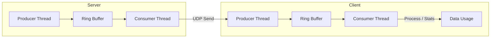
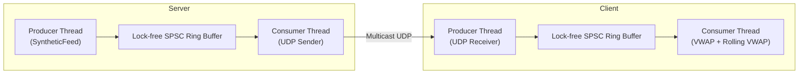

# High-Performance Market Data Feed Handler

This project implements optimized client-server architectures for streaming market data over UDP multicast.  
Each branch represents a different design evolution — starting from a simple model, scaling up to a batched, high-throughput feed handler.

---

## Branches Overview

| Branch             | Description                                                                                                             |
|--------------------|-------------------------------------------------------------------------------------------------------------------------|
| **main**           | Minimal client-server with synthetic data generation. Calculates rolling average over full session + time intervals.    |
| **vanilla-server** | Two-thread architecture on both client & server with lock-free SPSC ring buffers. Server produces and streams 1M ticks. |
| **batching-server**| Extension of vanilla-server. Server streams **10M ticks in batches of 100**, reaching >1M ticks/sec throughput.         |

---

---

## Architectures

### Baseline Architecture (applies to all branches)

At the core of this project, both the **server** and **client** follow a two-thread model with a lock-free **SPSC ring buffer** in between:

- **Server**
    - **Producer thread** generates synthetic market ticks and pushes them into the ring buffer.
    - **Consumer thread** pops ticks from the buffer and sends them over UDP to the client.

- **Client**
    - **Producer thread** receives ticks from the server and pushes them into its local ring buffer.
    - **Consumer thread** pops ticks for downstream processing (e.g., rolling average, statistics).

#### UML Architecture

### 1. Main Branch — Simple Client/Server with Rolling Average

- multi-threaded client/server.
- Client generates synthetic ticks and sends them to server.
- Server computes rolling average for session and intervals.

#### UML

#### Architecture Summary of Code
This project implements a baseline market data feed handler over multicast UDP, structured with a two-threaded design on both 
the server and client:

##### Server
* Producer thread uses a synthetic feed (`SyntheticFeed`) to continuously generate `MarketTick` objects (`price`, `volume`, `timestamp`).
* Lock-free SPSC ring buffer decouples production and transmission, ensuring minimal contention and predictable latency.
* Consumer thread drains the buffer and sends ticks to the client via multicast UDP, using an enlarged socket buffer to avoid kernel-level drops.

##### Client
* Producer thread receives packets from the UDP socket and writes them into a lock-free ring buffer.
* Consumer thread pops ticks and feeds them into:
    * A session-wide VWAP calculator.
    * A rolling VWAP calculator with a sliding window for real-time analytics.

#### Optimizations
* Lock-free SPSC queues → deterministic inter-thread handoff, reduced synchronization overhead.
* Thread separation (producer/consumer) → CPU cache locality improved, network IO isolated from computation.
* UDP multicast → realistic replication of exchange market data feeds.
* Compact `MarketTick` struct with` #pragma pack` → predictable memory layout, efficient serialization over the wire.