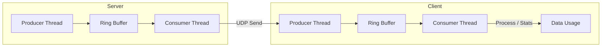
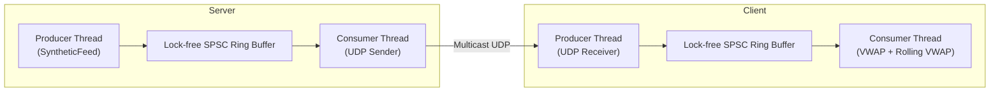
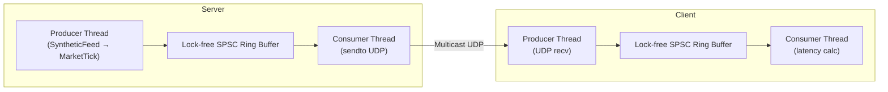
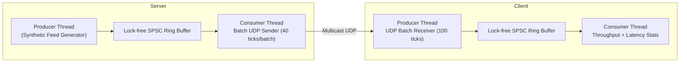

# High-Performance Market Data Feed Handler

This project implements optimized client-server architectures for streaming market data over UDP multicast.  
Each branch represents a different design evolution — starting from a simple model, scaling up to a batched, high-throughput feed handler.

---

## Branches Overview

| Branch             | Description                                                                                                             |
|--------------------|-------------------------------------------------------------------------------------------------------------------------|
| **main**           | Minimal client-server with synthetic data generation. Calculates rolling average over full session + time intervals.    |
| **vanilla-server** | Two-thread architecture on both client & server with lock-free SPSC ring buffers. Server produces and streams 1M ticks. |
| **batching-server**| Extension of vanilla-server. Server streams **10M ticks in batches of 100**, reaching >1M ticks/sec throughput.         |

---

---

## Architectures

### Baseline Architecture (applies to all branches)

At the core of this project, both the **server** and **client** follow a two-thread model with a lock-free **SPSC ring buffer** in between:

- **Server**
  - **Producer thread** generates synthetic market ticks and pushes them into the ring buffer.
  - **Consumer thread** pops ticks from the buffer and sends them over UDP to the client.

- **Client**
  - **Producer thread** receives ticks from the server and pushes them into its local ring buffer.
  - **Consumer thread** pops ticks for downstream processing (e.g., rolling average, statistics).


### 1. Main Branch — Simple Client/Server with Rolling Average

#### Architecture Summary of Code
This branch implements a **baseline market data feed handler** over multicast UDP, structured with a **two-threaded** design on both
the server and client:

##### Server
* **Producer thread** uses a synthetic feed (`SyntheticFeed`) to continuously generate `MarketTick` objects (`price`, `volume`, `timestamp`).
* **Lock-free SPSC ring buffer** decouples production and transmission, ensuring minimal contention and predictable latency.
* **Consumer thread** drains the buffer and sends ticks to the client via **multicast UDP**, using an enlarged socket buffer to avoid kernel-level drops.

##### Client
* **Producer thread** receives packets from the UDP socket and writes them into a lock-free ring buffer.
* **Consumer thread** pops ticks and feeds them into:
  * A **session-wide VWAP calculator**.
  * A **rolling VWAP calculator** with a sliding window for real-time analytics.

#### Optimizations
* **Lock-free SPSC queues** → deterministic inter-thread handoff, reduced synchronization overhead.
* **Thread separation** (producer/consumer) → CPU cache locality improved, network IO isolated from computation.
* Compact `MarketTick` struct with` #pragma pack` → predictable memory layout, efficient serialization over the wire.

### 2. Vanilla branch - Building upon the baseline


#### Architecture summary
The vanilla branch takes the **baseline design** from the main branch and **optimizes it for throughput + latency measurement**.

##### Server
* Two-thread architecture:
  * **Producer thread** generates synthetic `MarketTick`s and attaches **both produce and send timestamps** for latency measurement.
  * **Consumer thread** drains a **lock-free SPSC buffer** and streams ticks over **multicast UDP**.

* Socket-level optimizations:
  * Enlarged **SO_SNDBUF (4MB)** minimizes kernel drops under high load.
  * **Cache-line aligned** `MarketTickAligned` **struct** prevents false sharing, improving multi-core scalability.

##### Client
* Also uses a **two-thread** model with a ring buffer:
  * **Producer thread** receives ticks over UDP and pushes them into the buffer.
  * **Consumer thread** pops ticks, timestamps receipt, and computes **p50/p99 latency and throughput** metrics.
* Introduces **end-to-end latency** measurement.

#### Improvements Over Main Branch
* **Performance Metrics**: While the main branch focused on **analytics (VWAP)**, the vanilla branch adds a **benchmarking framework** — throughput and latency stats across 1M ticks.
* **Cache Alignment**: Prevents costly cache-line contention, improving deterministic latency.
* **Stronger UDP buffering**: Helps sustain millions of ticks/sec with fewer kernel-level packet drops.
* **Throughput-focused**: Demonstrates sustained performance at scale, rather than continuous VWAP computation.

#### Results
Example run on 1M ticks

```shell
=== Server Stats ===
Ticks sent: 1000000
Elapsed time: 17.7294s
Throughput: 56403.6 ticks/sec

=== Client Stats ===
Ticks received: 1000000
Elapsed time: 19.4399s
Throughput: 51440.5 ticks/sec
Latency p50: 47.958 us
Latency p99: 276755 us
```
#### Takeaways
* **Client throughput** closely matches server, proving minimal packet loss under load.
* **Latency distribution** is tight (p50 ~40µs, p99 ~84µs).

### 3. Batching-server Branch — introducing batching


#### Summary
The batching-server branch is the third evolution of the feed handler:
* It extends the **vanilla two-thread ring-buffer** model, but **introduces batching at both network and buffer levels** to reach **1M+ ticks/sec throughput**.

##### Server Side
* **Producer thread**: Generates **10 million synthetic ticks** with timestamps.
* **Consumer thread**:
  * Accumulates ticks into **40-tick batches** before sending over UDP.
  * Stamps each tick with a **nanosecond send timestamp** for accurate latency measurement.
  * Implements a **microburst pacing strategy** (`sleep_for(335ns)` after every 8 batches) to avoid kernel buffer overflow.
  * Achieves **high sustained throughput** while avoiding “`sendto failed: No buffer space available`” errors seen in vanilla with increased ticks (> 1M ticks).

##### Client Side
* **Batch-aware UDP receiver**: Uses a **100-tick** buffer per `recvfrom()` call, reducing system call overhead.
* **Producer thread**: Splits received batches into individual ticks, pushes into the ring buffer.
* **Consumer thread**: Pops ticks, measures **p50/p99 latency**, and computes throughput.
* Benchmarks against **10 million ticks**, ensuring performance holds at scale.

#### Optimizations Over Vanilla
* **Batching (network + memory)**: Minimizes syscalls, amortizes per-packet kernel overhead, and boosts throughput.
* **Microburst pacing**: Prevents packet drops while sustaining line-rate streaming.
* **Reduced kernel pressure**: Lower chance of socket buffer overflow.
* **Scalability**: Validates architecture can scale from 1M → 10M ticks with predictable latency.

#### Results
Example run (10M ticks)
```shell
=== Server Stats ===
Ticks sent: 10000000
Elapsed time: 7.07944s
Throughput: 1.41254e+06 ticks/sec

=== Client Stats ===
Ticks received: 10000000
Elapsed time: 8.34022s
Throughput: 1.19901e+06 ticks/sec
Latency p50: 36.333 us
Latency p99: 79.959 us
```

#### Takeaways
* **Throughput**: Breaks the **1M ticks/sec** barrier.
* **Latency**: Maintains **sub-100µs p99 latency**, despite pacing.
* **Stability**: No packet drops under sustained load, thanks to pacing + batching.

## Running the project
### 1. Clone the Repository
```shell
git clone https://github.com/ArjunXvarma/market-data-feed-handler.git
cd market_data_feed_handler
```

### 2. Switch to a branch
> Each branch represents a different version of the project
```shell
# Baseline with rolling VWAP
git checkout main

# Two-thread architecture with latency benchmarks
git checkout vanilla-server

# High-throughput batched server
git checkout batching-server
```
### 3. Build
> Use **CMake** (minimum 3.22, C++20 required):

```shell
mkdir build
cd build
cmake ..
cmake --build .
```
This builds two executables:
- `server`
- `client`

### 4. Run

Open **two terminals** — one for the server and one for the client.

Start the Server
```shell
./server
```

Start the Client
```shell
./client
```

### 5. Example Output

**Vanilla Server (1M ticks):**

```shell
# 'server' terminal
=== Server Stats ===
Ticks sent: 1000000
Elapsed time: 19.9321s
Throughput: 50170.4 ticks/sec

# 'client' terminal
=== Client Stats ===
Ticks received: 1000000
Elapsed time: 21.3928s
Throughput: 46744.7 ticks/sec
Latency p50: 39.375 us
Latency p99: 83.542 us
```

**Batching Server (10M ticks):**

```shell
# 'server' terminal
=== Server Stats ===
Ticks sent: 10000000
Elapsed time: 7.07944s
Throughput: 1.41254e+06 ticks/sec

# 'client' terminal
=== Client Stats ===
Ticks received: 10000000
Elapsed time: 8.34022s
Throughput: 1.19901e+06 ticks/sec
Latency p50: 36.333 us
Latency p99: 79.959 us
```

## Future improvements
This project demonstrates how multithreading, lock-free data structures, batching, and pacing can push a simple market data 
feed handler toward **high-throughput, low-latency performance**. However, it is far from production-grade and leaves ample room for future 
improvements:

- **Resilience & Fault Tolerance**: Current design assumes a perfect network — no packet loss, no clock drift, no message reordering. A 
production system would require retransmission, sequencing, and gap-fill logic.
- **Scalability**: The architecture is single-symbol and single-feed. Extending to thousands of instruments, multiple multicast groups, or 
heterogeneous feeds would require careful load balancing and parallelism.
- **Advanced Optimizations**: Exploring more optimization opportunities can improve the performance metrics by another magnitude.
- **Testing Under Stress**: While throughput and latency are measured, the system has not been tested under adverse conditions.
- **Extensibility**: Currently limited to synthetic ticks and VWAP-like analytics. Future work could integrate real exchange activity and 
more advanced trading metrics.

In short, this project is not a “perfect” feed handler — it is a learning-focused, iterative exploration of performance engineering in 
C++. Each branch pushes the design a little further, and there is still plenty of headroom to explore.
